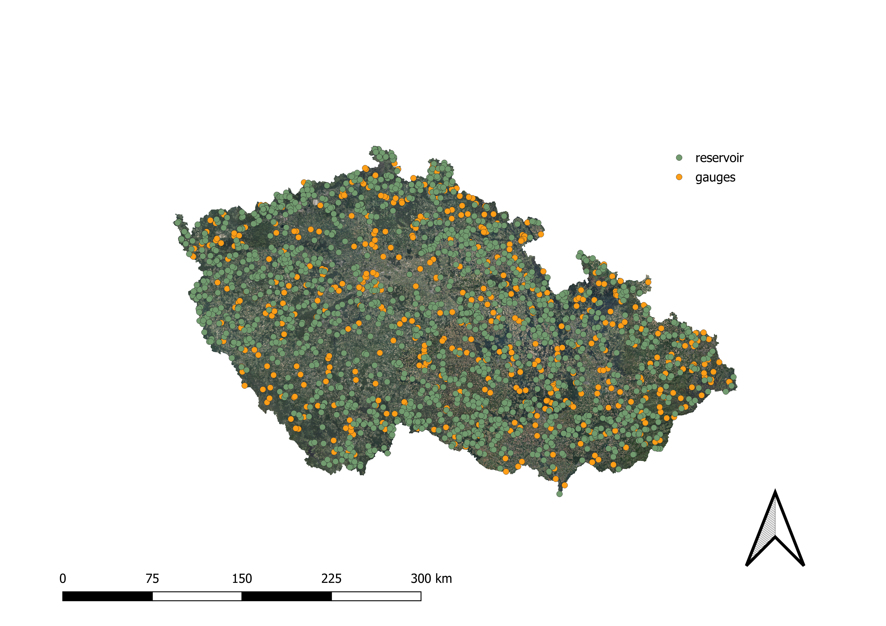
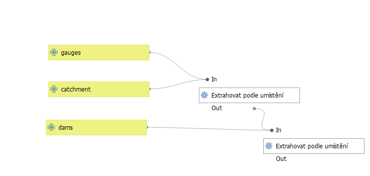

# Catchment recession analysis
GIS and Python workflow for analysing the relationship between catchment land use and flood-wave recession.
# Overview

This project combines spatial analysis in QGIS with hydrological time-series processing in Python to evaluate how land use composition influences flood wave recession dynamics.

The workflow integrates:

+ catchment delineation (4th-order basins in the Czech Republic),
+ gauging station selection,
+ exclusion of reservoirs,
+ CORINE Land Cover analysis,
+ CHMI discharge time series processing,
+ flood event detection,
+ recession analysis (time to 50% peak discharge).

# Workflow

+ Load catchment polygons (4th order)
+ Select catchments with gauging stations
+ Remove catchments influenced by reservoirs
+ Overlay CORINE Land Cover data
+ Compute land use statistics
+ Export results to CSV
+ Load CHMI discharge time series
+ Detect extreme flood events
+ Compute recession time (t50)
+ Compare catchments

# Study Concept

The project tests the following hypothesis:

Catchments with a higher proportion of artificial surfaces exhibit faster flood wave recession compared to more permeable catchments.

# Results

Initial findings suggest:

+ Higher impermeable surface ratio → faster hydrological response
+ Higher permeable surface ratio → slower recession

Note: results are based on a limited sample size.

# Data Sources

+ CORINE Land Cover (Copernicus)
+ Czech Hydrometeorological Institute (CHMI)
+ Czech catchment delineation datasets

# Technologies Used

+ QGIS (Model Builder)
+ Python
+ Pandas
+ NumPy
+ Matplotlib
+ CHMI hydrological data
+ CORINE Land Cover

# Project Structure
src/           Python scripts

qgis/          QGIS model workflows

data/          Input and processed data

images/        Figures for README

outputs/       Generated results

docs/          Documentation
